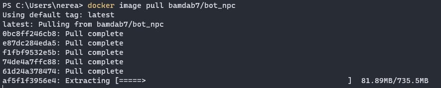
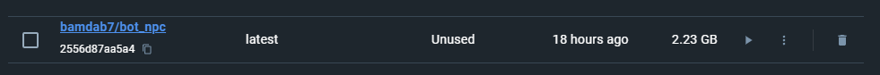
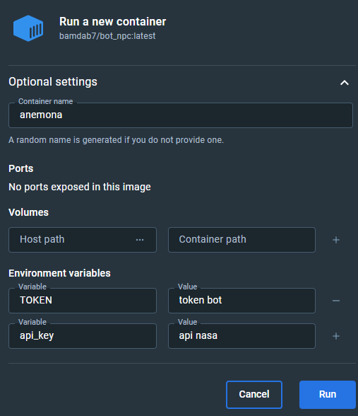
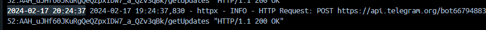
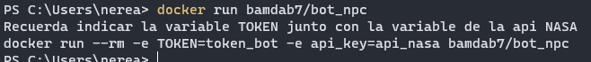
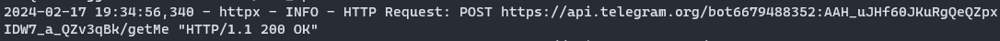

# Bot de Telegram Anemona de mar 🌊

## Introduccion ✨

Este proyecto ofrece un bot de Telegram para diversos usos.
Con este bot podrás, entre otras cosas:

* Consultar cartelera de cine y prensa (baloncesto y peliculas)
* Tiempo del concello de Monfero 
* Saber todo acerca del mundo de StarWars
* Picture of the day (NASA)

## Requisitos previos ✨
>  TOKEN BOT  
Como el planteamiento inicial de este bot no es compartir la clave TOKEN de éste, sino usar una propia es **importante tener la clave TOKEN de el bot donde queremos ejecutar este programa**. Un bot de Telegram es facil de lanzar y la clave TOKEN es muy simple. En el caso de desconocer el funcionamiento se puede consultar la *documentacion oficial* sobre los bots de Telegram: https://core.telegram.org/bots/api

> TOKEN API NASA  
Otra de los requisitos necesarios es el disponer de una **API_KEY de la NASA** para poder conectarse y obtener la foto astronomica del dia. La API se puede obtener registrandose en la *pagina oficial*:
https://api.nasa.gov/

> DOCKER   
Este bot cuenta con una capacidad para lanzarse desde Docker y para ello es necesario instalarse el **programa Docker**, ya que cuando ejecutemos  el bot, éste debera estar abierto. https://docs.docker.com/
A mayores tambien es interesante saber sobre el docker compose y como funciona, ya que parte de la ejecucion del bot se empleara desde consola. https://docs.docker.com/compose/

## Instalacion y ejecucion del bot ✨
El bot será referenciado con el nombre de **bambab7/bot_npc**
1.  Lanzaremos la aplicacion de Docker Desktop
2.  Abriremos consola y ejecutaremos el siguiente comando `docker image pull bamdab7/bot_npc`, el proceso tardara un poco, ya que esta instalando todos los paquetes y librerias necesarias para que el bot funcione. 
    * *Este proceso tambien se puede hacer buscando en la aplicacion Docker Desktop la imagen del bot directamente y dandole a RUN*  

3. Tras haber finalizado la descarga, entraremos en la aplicacion de Docker Desktop para ver si se ha descargado correctamente la imagen.  
**A partir de este punto se puede ejecutar el bot de dos maneras distintas.**

### Ejecutando bot desde Docker Desktop  
  
1. Ejecutaremos el contenedor dandole al boton de play que hay en nuestra imagen (RUN).
2. Una vez de damos a RUN se nos abrira una ventana emeregente en la que podemos añadir ajustes adicionales, entramos en esa seccion y manualmente introduciremos las dos TOKEN que previamente hemos conseguido.
3. Ver imagen para mas informacion, **es importante que las variables se escriban exactamente igual que en la imagen, de no ser asi dara error**  
  
4. Le damos a RUN  
5. Automaticamente nos redirige a una consola de Docker en la que nos notifica que nuestro bot ha sido lanzado con exito.  
  

### Ejecutando bot desde consola  
1. Partiremos del punto en el que hemos descargado la imagen de nuestro bot.
2. Una vez termina el proceso ejecutaremos en nuestra consola el siguiente comando `docker run bamdab7/bot_npc`. Este comando está incompleto ya que nos faltan ambas TOKENS, pero el mensaje que lanza avisandonos de que faltan, nos permite saber que poner en todo momento. Igual que la instalacion,el lanzamiento tambien es lento debido a la cantidad de cosas que necesita ejecutar.

3. Por tanto introduciremos el mensaje sustituyendo por nuestras APIS. El mensaje es este: `docker run --rm -e TOKEN=tokenbot -e api_key=apinasa bamdab7/bot_npc`
4. Y de nuevo nos notifica que nuestro bot esta en perfecto funcionamiento

## Comandos ✨

Este bot esta elaborado en Python y emplea librerias tales como `python-telegram-bot`, `pymysql` o `numpy` entre otras.

El bot cuenta con unos comandos propios que permiten ejecutar las diferentes consultas, aqui se especifican:

**Comandos principales**

* **/help** este comando muestra una pequeña ayuda
* **/start** comando principal, da la bienvenida al usuario

**Consultas**

* **/nasa** obtienes la imagen astronomica del dia gracias a la NASA
* **/meteo** obtienes la prediccion meteorologica del concello de Monfero
* **/inferno** una vez introducido este comando podrás comprobar si has cometido un pecado en el infierno (y en el caso de haberlo cometido, cual ha sido)
* **/jokes** obtienes un chiste variado (mayoritariamente relacionado con informatica)
* **/scrapp** analiza diversas paginas web ↴
    1. **Cartelera**: cartelera de cine con las ultimas peliculas e informacion relevante
    2. **Baloncesto**:  seccion de noticias relevantes relacionadas con LebOro 
    3. **Voz de Galicia**: seccion de noticias relevantes de A Coruña del periodico Voz de Galicia 
    4. **Palabras mas buscadas**: listado de las palabras mas buscadas del diccionario de la Real Academia Galega
* **/starwars** este comando abre un menu en el que se pueden seleccionar diferentes aspectos para conocer sobre Star Wars ↴
    1. **Personajes**: muestra un personaje aleatorio de la saga con informacion relevante acerca de el
    2. **Planetas**: muestra un planeta aleatorio con informacion sobre el planeta seleccionado
    3. **Naves**: muestra datos de interes sobre las naves de la saga
    4. **Especies**: muestra informacion sobre las especies y algunos personajes que son de esta
    5. **Peliculas**: muestra el director de pelicula junto con la introduccion caracteristica
* **ficheros** el bot permite enviar un fichero .csv o .json y devolverlo en el formato inverso junto con informacion acerca del documento
